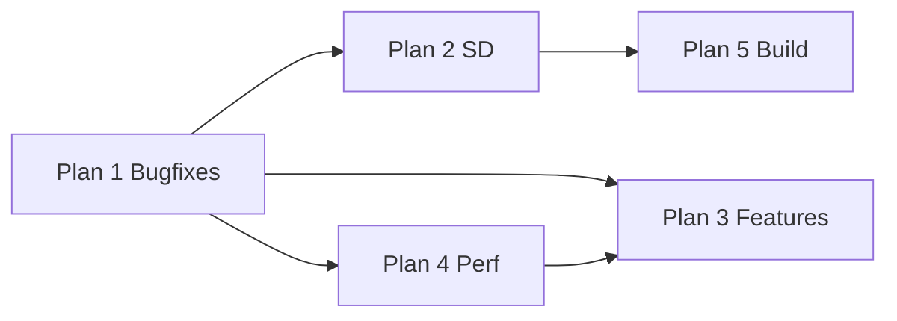

# Wall-Z verbeteringen — master index

Flash na STL-refactor: **39,5%** (103.596 / 262.144 B). Onderstaande 5 plannen vervangen het enkelvoudige overzicht.

## Plannen

| # | Plan | Focus | Bestand |
|---|------|-------|---------|
| **1** | Bugfixes + SD-schema | Menu logging, loop gates, **SD-tabel**, USE_LIGHT/USE_AUDIO, HM_10_BLE weg | [01-bugfixes-gates-logging.plan.md](c:/workspace/projects/Arduino_Projects/Arduino-R4_UNO_Wall-Z/.cursor/plans/01-bugfixes-gates-logging.plan.md) |
| **2** | SD config | configSaveSD zonder String, naam-parse, lazy init | [02-sd-config-heap.plan.md](c:/workspace/projects/Arduino_Projects/Arduino-R4_UNO_Wall-Z/.cursor/plans/02-sd-config-heap.plan.md) |
| **3** | Features | config.h profielen, USE_ROBOT/sensors/menu aanzetten | [03-features-config-profiles.plan.md](c:/workspace/projects/Arduino_Projects/Arduino-R4_UNO_Wall-Z/.cursor/plans/03-features-config-profiles.plan.md) |
| **4** | Responsiviteit | MicStereo non-blocking, setup delays, sonar | [04-loop-responsiveness.plan.md](c:/workspace/projects/Arduino_Projects/Arduino-R4_UNO_Wall-Z/.cursor/plans/04-loop-responsiveness.plan.md) |
| **5** | Build & tests | lib_deps trimmen, native tests uitbreiden | [05-build-cleanup-tests.plan.md](c:/workspace/projects/Arduino_Projects/Arduino-R4_UNO_Wall-Z/.cursor/plans/05-build-cleanup-tests.plan.md) |

## Aanbevolen volgorde

1. **Plan 1** — bugs eerst (SD-flags + menu kapot)
2. **Plan 2** — heap/SD robuustheid (menu save)
3. **Plan 3** — features aanzetten (na plan 1 verplicht voor USE_ROBOT+SD)
4. **Plan 4** — mic non-blocking vóór USE_MIC in productie
5. **Plan 5** — opruiming; kan deels parallel met 3/4

## Al afgerond (niet opnieuw)

- STL/iostream removal (flash 93% → 39,5%)
- millis + Deadline in loop-path (avoid, dance, display, PS4)
- Native tests: deadline + ps4_parse (13/13)

## Locatie

Alle plannen staan in:

`c:\workspace\projects\Arduino_Projects\Arduino-R4_UNO_Wall-Z\.cursor\plans\`
