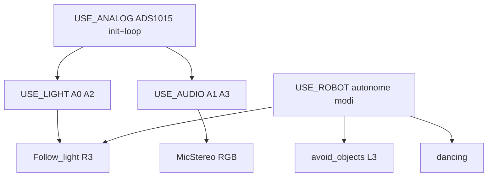

# Plan 1 — Bugfixes, SD-variabelen & feature-gates

**Project:** [Arduino-R4_UNO_Wall-Z](c:/workspace/projects/Arduino_Projects/Arduino-R4_UNO_Wall-Z)  
**Afhankelijkheden:** geen (start hier)  
**Geschatte scope:** 1–2 sessies

## Doel

1. Bugs fixen (menu-logging, loop-gates, MicStereo PWM-gate)
2. **Alle SD-variabelen documenteren** — wat doet elke optie?
3. **Schema v2:** vervangingen toevoegen (`USE_LIGHT`, `USE_AUDIO`), dode opties verwijderen (`USE_HM_10_BLE`, **`USE_IRREMOTE`**)
4. Gates in code aligned met werkelijk gedrag in `src/`

Conventie blijft:

> SD aanwezig → runtime `main::use_*` · geen SD → compile-time `USE_*` uit [`config.h`](c:/workspace/projects/Arduino_Projects/Arduino-R4_UNO_Wall-Z/src/config.h)

```cpp
#define FEATURE_ENABLED(use_flag, USE_MACRO) (main::use_sd_card ? (use_flag) : (USE_MACRO))
```

---

## Deel A — Referentietabel SD-variabelen (huidig schema)

Elke regel in `SETUP.TXT` heeft formaat `KEY,0|1`. Index = positie in bestand (fragiel — plan 2 maakt dit naam-gebaseerd).

| Index | SD-key | Jouw waarde | Wat het doet | Module / pins | Opmerking |
|-------|--------|-------------|--------------|---------------|-----------|
| 0 | `USE_ADAFRUIT` | 0 | SSD1306 OLED loop (`displayLoop`) | [`displayAdafruit.cpp`](c:/workspace/projects/Arduino_Projects/Arduino-R4_UNO_Wall-Z/src/displayAdafruit.cpp) | Display wordt wel geïnitialiseerd in setup; flag gate't loop |
| 1 | `USE_U8G2` | 0 | Alternatief display (U8g2) | — | **Niet geïmplementeerd** in huidige `src/` |
| 2 | `SMALL` | 0 | Klein OLED-formaat | menu/display | Flag bestaat; weinig effect in huidige code |
| 3 | `DISPLAY_DEMO` | 0 | Menu schakelt auto tussen schermen | [`menu.cpp:525`](c:/workspace/projects/Arduino_Projects/Arduino-R4_UNO_Wall-Z/src/menu.cpp) | Demo-modus |
| 4 | `USE_ROUND` | 0 | Rond GC9A01 display | — | **Niet actief** in huidige build |
| 5 | `USE_MENU` | **1** | On-device config menu op OLED | [`menu.cpp`](c:/workspace/projects/Arduino_Projects/Arduino-R4_UNO_Wall-Z/src/menu.cpp) | Geen `#if` — pure runtime |
| 6 | `LOG_DEBUG` | **1** | Extra Serial/OLED logging | [`logger.cpp`](c:/workspace/projects/Arduino_Projects/Arduino-R4_UNO_Wall-Z/src/logger.cpp) | Veel `#if LOG_DEBUG` in modules |
| 7 | `USE_PS4` | **1** | PS4 via Serial1 (ESP32-bridge) | [`PS4.cpp`](c:/workspace/projects/Arduino_Projects/Arduino-R4_UNO_Wall-Z/src/PS4.cpp) | Sticks, knoppen, motor/servo |
| 8 | `USE_SD_CARD` | **1** | SD gemount + flags geladen | [`SD_card.cpp`](c:/workspace/projects/Arduino_Projects/Arduino-R4_UNO_Wall-Z/src/SD_card.cpp) | Zet `main::use_sd_card` |
| 9 | `USE_GYRO` | **1** | MPU6050 beweging | [`gyroscope.cpp`](c:/workspace/projects/Arduino_Projects/Arduino-R4_UNO_Wall-Z/src/gyroscope.cpp) | PS4 OPTION-knop |
| 10 | `USE_COMPASS` | **1** | HMC5883 kompas | [`compass.cpp`](c:/workspace/projects/Arduino_Projects/Arduino-R4_UNO_Wall-Z/src/compass.cpp) | PS4 SHARE-knop |
| 11 | `USE_BAROMETER` | **1** | BMP280 druk/temp | [`barometer.cpp`](c:/workspace/projects/Arduino_Projects/Arduino-R4_UNO_Wall-Z/src/barometer.cpp) | PS4 HOME / touchpad |
| 12 | `USE_DISTANCE` | **1** | Ultrasonic afstand + laser/LED | [`avoid_objects.cpp`](c:/workspace/projects/Arduino_Projects/Arduino-R4_UNO_Wall-Z/src/avoid_objects.cpp) | Trig=5, Echo=6; loop elke 60 ms |
| 13 | ~~`USE_IRREMOTE`~~ | ~~1~~ | ~~IR-afstandsbediening (exit robot)~~ | [`PS4.cpp:44`](c:/workspace/projects/Arduino_Projects/Arduino-R4_UNO_Wall-Z/src/PS4.cpp) | **VERWIJDEREN** — sensor niet meer aanwezig |
| 14 | `USE_I2C_SCANNER` | **1** | I2C bus scan bij boot | [`I2Cscanner.cpp`](c:/workspace/projects/Arduino_Projects/Arduino-R4_UNO_Wall-Z/src/I2Cscanner.cpp) | Boot-only |
| 15 | `USE_PWM_BOARD` | **1** | PCA9685 servos, RGB, laser | [`pwm_board.cpp`](c:/workspace/projects/Arduino_Projects/Arduino-R4_UNO_Wall-Z/src/pwm_board.cpp) | LAZER_PIN=11 |
| 16 | `USE_DOT` | **1** | Pesto dot-matrix emoties | [`pesto_matrix.cpp`](c:/workspace/projects/Arduino_Projects/Arduino-R4_UNO_Wall-Z/src/pesto_matrix.cpp) | Pins 2, 4 |
| 17 | `USE_MIC` | **1** | Stereo-mic → RGB reactie | [`MicStereo.cpp`](c:/workspace/projects/Arduino_Projects/Arduino-R4_UNO_Wall-Z/src/MicStereo.cpp) | **→ wordt `USE_AUDIO`** (A1, A3) |
| 18 | `USE_SWITCH` | 0 | Digitale schakelaars D8/D9 | [`main_ra.cpp`](c:/workspace/projects/Arduino_Projects/Arduino-R4_UNO_Wall-Z/src/main_ra.cpp) | INPUT_PULLUP |
| 19 | `USE_ANALOG` | **1** | ADS1015 I2C ADC — leest **alle 4** kanalen | [`analog.cpp`](c:/workspace/projects/Arduino_Projects/Arduino-R4_UNO_Wall-Z/src/analog.cpp) | Master switch voor ADS1015 |
| 20 | `USE_ROBOT` | **1** | Autonome modi (avoid/dance/light) | avoid + dance + follow_light | PS4 L3/R3; sub-modi zie hieronder |
| 21 | `USE_TIMERS` | **1** | TimerEvent periodieke taken | [`timers.cpp`](c:/workspace/projects/Arduino_Projects/Arduino-R4_UNO_Wall-Z/src/timers.cpp) | PS4 L1/R1 toggle |
| 22 | `USE_MATRIX` | 0 | Uno R4 onboard LED matrix animatie | main_ra setup | Niet in jouw setup |
| 23 | `USE_MATRIX_PREVIEW` | 0 | Matrix frame via Serial | main_ra loop | Niet in jouw setup |
| 24 | `READ_ESP32` | 0 | UART lezen onboard ESP32-S3 | `SERIAL_AT` / Serial2 | Niet in jouw setup |
| 25 | `USE_LCD` | 0 | LCD display variant | — | **Niet geïmplementeerd** in `src/` |
| 26 | `USE_HM_10_BLE` | 0 | HM-10 BLE module | `BLE::BLEsetup()` | **Dood — geen BLE.cpp** · **verwijderen** |

### Analog-kanalen ([`config.h:88–91`](c:/workspace/projects/Arduino_Projects/Arduino-R4_UNO_Wall-Z/src/config.h))

| Pin define | ADS kanaal | Fysiek | Gebruikt door | Huidige gate |
|------------|------------|--------|---------------|--------------|
| `light_L_PIN` | EXT_ANALOG_0 (A0) | Lichtsensor links | `Follow_light` (L3 lichtvolgen) | `USE_ROBOT` + `USE_ANALOG` |
| `MIC_L_PIN` | EXT_ANALOG_1 (A1) | Mic links | `MicStereo` | `USE_MIC` + `USE_ANALOG` |
| `light_R_PIN` | EXT_ANALOG_2 (A2) | Lichtsensor rechts | `Follow_light` | idem light |
| `MIC_R_PIN` | EXT_ANALOG_3 (A3) | Mic rechts | `MicStereo` | `USE_MIC` + `USE_ANALOG` |

**Probleem nu:** `USE_ANALOG=1` leest alles; `USE_MIC=1` is te generiek; licht volgen zit verstopt onder `USE_ROBOT` zonder aparte `USE_LIGHT`.

### USE_ROBOT sub-modi (allemaal achter één flag)

| Modus | Start (PS4) | Module | Sensor |
|-------|-------------|--------|--------|
| Obstacle avoid | L3 | [`avoid_objects.cpp`](c:/workspace/projects/Arduino_Projects/Arduino-R4_UNO_Wall-Z/src/avoid_objects.cpp) | Ultrasonic (`USE_DISTANCE`) |
| Light follow | R3 | [`follow_light.cpp`](c:/workspace/projects/Arduino_Projects/Arduino-R4_UNO_Wall-Z/src/follow_light.cpp) | Light A0/A2 |
| Dance | (via code) | [`dancing.cpp`](c:/workspace/projects/Arduino_Projects/Arduino-R4_UNO_Wall-Z/src/dancing.cpp) | Geen sensor |

Optioneel later (plan 3): splitsen in `USE_AVOID`, `USE_DANCE`, `USE_LIGHT_FOLLOW`.

### Alleen compile-time (niet op SD)

| Define | In config.h | Op SD? |
|--------|-------------|--------|
| `LOG_VERBOSE` | 1 | **Nee** — SD dump / ruwe regels |
| `USE_*` defaults | per flag | Fallback als geen SD |

---

## Deel B — Schema v2 (nieuw / vervangen / verwijderen)

### Verwijderen

| Key | Reden | Code opruimen |
|-----|-------|---------------|
| `USE_HM_10_BLE` | Geen implementatie; `BLE::BLEsetup()` linkt nergens naartoe | `main_ra.cpp`, `main_ra.h`, `SD_card`, `menu`, `config.h` |
| **`USE_IRREMOTE`** | **IR-ontvanger niet meer gemonteerd** | [`PS4.cpp:44–52`](c:/workspace/projects/Arduino_Projects/Arduino-R4_UNO_Wall-Z/src/PS4.cpp) `#if USE_IRREMOTE` blok in `exitLoop()`; `use_irremote` overal; `#define Rem_OK` en `//#define IR_Pin` in [`config.h`](c:/workspace/projects/Arduino_Projects/Arduino-R4_UNO_Wall-Z/src/config.h) |

Geen IR-library in `platformio.ini` lib_deps — alleen dead code in firmware.

### Hernoemen / splitsen

| Oud | Nieuw | Gedrag |
|-----|-------|--------|
| `USE_MIC` | **`USE_AUDIO`** | `MicStereo::MicLoop()` — kanalen A1 + A3 |
| (implicit) | **`USE_LIGHT`** | Lichtsensoren A0 + A2; `Follow_light` eligibility; light-waarden in verbose log |

### Behouden (ongewijzigd)

Alle andere keys uit jouw SETUP.TXT blijven, minus `USE_HM_10_BLE` en **`USE_IRREMOTE`**.

### Hiërarchie (schema v2)



**Regels implementatie:**

- `USE_ANALOG=0` → ADS1015 uit; `USE_LIGHT` en `USE_AUDIO` hebben geen effect
- `USE_LIGHT=0` → `Follow_light::light_track()` / tick no-op (ook als `USE_ROBOT=1`)
- `USE_AUDIO=0` → `MicStereo::MicLoop()` niet aangeroepen
- `USE_ROBOT=0` → geen avoid/dance/light **start** via PS4; distance-meting kan wel (`USE_DISTANCE`)

### Backward compatibility bij load

In `configLoadSD()` (plan 1 + plan 2):

```cpp
// Oude SETUP.TXT — onbekende/verwijderde keys negeren
if (strcmp(key, "USE_MIC") == 0)       apply(USE_AUDIO, value);
if (strcmp(key, "USE_HM_10_BLE") == 0) { /* ignore */ }
if (strcmp(key, "USE_IRREMOTE") == 0)  { /* ignore — sensor weg */ }
if (strcmp(key, "USE_AUDIO") == 0)     apply(USE_AUDIO, value);
if (strcmp(key, "USE_LIGHT") == 0)     apply(USE_LIGHT, value);
```

---

## Deel C — Jouw SETUP.TXT → schema v2

**Huidig** (27 regels):

```
USE_ADAFRUIT,0 … USE_HM_10_BLE,0
```

**Voorgesteld na migratie** (25 regels — `USE_HM_10_BLE`, `USE_IRREMOTE` weg; `USE_MIC`→`USE_AUDIO`; `USE_LIGHT` nieuw):

```
USE_ADAFRUIT,0
USE_U8G2,0
SMALL,0
DISPLAY_DEMO,0
USE_ROUND,0
USE_MENU,1
LOG_DEBUG,1
USE_PS4,1
USE_SD_CARD,1
USE_GYRO,1
USE_COMPASS,1
USE_BAROMETER,1
USE_DISTANCE,1
USE_I2C_SCANNER,1
USE_PWM_BOARD,1
USE_DOT,1
USE_AUDIO,1          ← was USE_MIC,1
USE_SWITCH,0
USE_ANALOG,1
USE_LIGHT,1          ← NIEUW (lichtvolgen + A0/A2)
USE_ROBOT,1
USE_TIMERS,1
USE_MATRIX,0
USE_MATRIX_PREVIEW,0
READ_ESP32,0
USE_LCD,0
```

**Aanbevelingen voor jouw robot:**

| Key | Huidig | Advies | Waarom |
|-----|--------|--------|--------|
| `USE_ADAFRUIT` | 0 | **1** als OLED aan | Anders geen `displayLoop` |
| `LOG_DEBUG` | 1 | **0** voor rijden | Minder Serial spam |
| `USE_I2C_SCANNER` | 1 | **0** na debug | Snellere boot |

---

## Deel D — Bugfixes (ongewijzigd doel)

### D1 — Menu-logging

[`menu.cpp:588–710`](c:/workspace/projects/Arduino_Projects/Arduino-R4_UNO_Wall-Z/src/menu.cpp) — pointer-arithmetiek → `logFlag()` / `logItem()`.

Menu-items array uitbreiden voor schema v2:

- Vervang `"use_mic"` → `"use_audio"`
- Voeg `"use_light"` toe
- Verwijder `"use_hm_10_ble"` en **`"use_irremote"`**
- `NUM_ITEMS` aanpassen (27 → **26** menu-items)

### D2 — Loop dual-path gates

Patroon voor elke compile-time feature:

```cpp
if (main::use_sd_card) {
    if (main::use_dot) Pesto::pestoMatrix();
} else {
#if USE_DOT
    Pesto::pestoMatrix();
#endif
}
```

Toepassen op: ROBOT ticks, DOT, **AUDIO** (was MIC), TIMERS, READ_ESP32, MATRIX_PREVIEW.

### D3 — PS4 gates

| Knop | Huidig | Fix |
|------|--------|-----|
| L3 avoid | `#if USE_ROBOT` | dual-path + `USE_ROBOT` |
| R3 light | `#if USE_ROBOT` | dual-path + **`USE_LIGHT`** check |
| L1/R1 timers | `#if USE_TIMERS` | dual-path |
| ~~IR exit~~ | ~~`#if USE_IRREMOTE`~~ | **Verwijderen** — hele blok uit `PS4::exitLoop()` |

### D4 — MicStereo PWM-gate

`(USE_PWM_BOARD && !use_pwm) \|\| use_pwm` → `FEATURE_ENABLED(main::use_pwm_board, USE_PWM_BOARD)`.

---

## Deel E — Bestanden

| Bestand | Wijziging |
|---------|-----------|
| [`src/config.h`](c:/workspace/projects/Arduino_Projects/Arduino-R4_UNO_Wall-Z/src/config.h) | `USE_LIGHT`, `USE_AUDIO`; `#define USE_MIC USE_AUDIO` alias; **`USE_HM_10_BLE` + `USE_IRREMOTE` + `Rem_OK` weg** |
| [`src/main_ra.h`](c:/workspace/projects/Arduino_Projects/Arduino-R4_UNO_Wall-Z/src/main_ra.h) | `use_light`, `use_audio`; verwijder `use_hm_10_ble`, **`use_irremote`** |
| [`src/main_ra.cpp`](c:/workspace/projects/Arduino_Projects/Arduino-R4_UNO_Wall-Z/src/main_ra.cpp) | Init defaults, setup/loop gates |
| [`src/SD_card.cpp`](c:/workspace/projects/Arduino_Projects/Arduino-R4_UNO_Wall-Z/src/SD_card.cpp) | Load/save keys v2; USE_MIC alias |
| [`src/menu.cpp`](c:/workspace/projects/Arduino_Projects/Arduino-R4_UNO_Wall-Z/src/menu.cpp) | Menu items + logging |
| [`src/MicStereo.cpp`](c:/workspace/projects/Arduino_Projects/Arduino-R4_UNO_Wall-Z/src/MicStereo.cpp) | Gate `USE_AUDIO` |
| [`src/follow_light.cpp`](c:/workspace/projects/Arduino_Projects/Arduino-R4_UNO_Wall-Z/src/follow_light.cpp) | Gate `USE_LIGHT` in start/tick |
| [`src/analog.cpp`](c:/workspace/projects/Arduino_Projects/Arduino-R4_UNO_Wall-Z/src/analog.cpp) | Optioneel: light/audio kanalen alleen lezen als flag aan |
| [`src/PS4.cpp`](c:/workspace/projects/Arduino_Projects/Arduino-R4_UNO_Wall-Z/src/PS4.cpp) | dual-path robot/timers; **IR-blok verwijderen** |

---

## Deel F — Verificatie

1. `pio test -e native` — groen
2. `pio run -e src` — flash < 50%
3. Oude `SETUP.TXT` met `USE_MIC,1` → laadt als `use_audio=true`
4. `USE_LIGHT,0` → R3 lichtvolgen start niet
5. `USE_HM_10_BLE,0` / `USE_IRREMOTE,1` in oud bestand → geen crash, genegeerd bij load
6. Menu toggle → `"use_audio: true"` op Serial **en** OLED

## Relatie andere plannen

- **Plan 2:** naam-gebaseerde parse + `configSaveSD` zonder String (bouwt voort op schema v2)
- **Plan 3:** config.h profielen met `USE_LIGHT`/`USE_AUDIO`/`USE_ROBOT`
- **Plan 4:** MicStereo non-blocking (USE_AUDIO aan)
