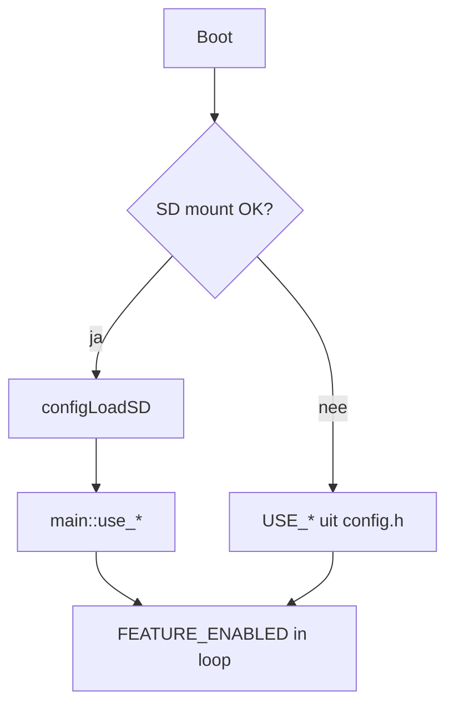

# Plan 3 — Features & config-profielen

**Project:** [Arduino-R4_UNO_Wall-Z](c:/workspace/projects/Arduino_Projects/Arduino-R4_UNO_Wall-Z)  
**Afhankelijkheden:** plan 1 (loop gates) vóór `USE_ROBOT=1` met SD  
**Geschatte scope:** vooral config + hardware-test, weinig code

## Context

Na STL-refactor: **flash 39,5%** (103.596 B). Voorheen 93% — veel `#if USE_*=0` alleen om overflow te voorkomen. Nu kunnen flags weer aan.

Dual-path blijft heilig ([`main_ra.h:11–12`](c:/workspace/projects/Arduino_Projects/Arduino-R4_UNO_Wall-Z/src/main_ra.h)):

- SD + `SETUP.TXT` → runtime `main::use_*`
- Geen SD → compile-time [`config.h`](c:/workspace/projects/Arduino_Projects/Arduino-R4_UNO_Wall-Z/src/config.h)

## Huidige config.h (baseline)

| Flag | Waarde | Module |
|------|--------|--------|
| USE_PS4 | 1 | Serial1 PS4 bridge |
| USE_DISTANCE | 1 | Ultrasonic + laser/LED feedback |
| USE_PWM_BOARD | 1 | PCA9685 |
| USE_DOT | 1 | Pesto dot matrix |
| USE_I2C_SCANNER | 1 | Boot I2C scan |
| LOG_DEBUG | 1 | Veel logging |
| LOG_VERBOSE | 1 | SD/config dump |
| USE_ROBOT | 0 | Avoid / dance / light-follow |
| USE_GYRO/COMPASS/BAROMETER | 0 | I2C sensors |
| USE_MIC | 0 | Stereo mic → RGB |
| USE_MENU | 0 | On-device config UI |
| USE_TIMERS | 0 | TimerEvent + PS4 L1/R1 |
| READ_ESP32 | 0 | Onboard ESP32-S3 UART |
| USE_SD_CARD | 0 | Default no-SD build path |

## Voorgestelde profielen

### Profiel A — MINIMAL (huidige default + robot)

Voor dagelijks rijden met PS4:

```cpp
#define USE_PS4 1
#define USE_DISTANCE 1
#define USE_PWM_BOARD 1
#define USE_DOT 1
#define USE_ROBOT 1        // NEW — vereist plan 1
#define USE_I2C_SCANNER 0  // snellere boot
#define LOG_DEBUG 0
#define LOG_VERBOSE 0
```

**Geschatte flash:** ~45–50% (meten na build).

### Profiel B — SENSORS

Robot + beweging/klimaat:

```cpp
// Profiel A +
#define USE_GYRO 1
#define USE_COMPASS 1
#define USE_BAROMETER 1
#define USE_I2C_SCANNER 1
```

**Test:** tilt detectie op OLED; kompas waarden; BMP280 druk/temp.

### Profiel C — FULL DEMO

Alles wat hardware heeft:

```cpp
// Profiel B +
#define USE_MIC 1          // plan 4 aanbevolen vóór mic in productie-loop
#define USE_MENU 1
#define USE_TIMERS 1
#define USE_SWITCH 1
#define USE_ANALOG 1
#define READ_ESP32 1       // alleen als ESP32-S3 onboard gevuld
#define LOG_DEBUG 1        // alleen debug sessies
```

**Geschatte flash:** ~55–65% — nog ruim onder limiet.

### Profiel D — SD-RUNTIME

Hardware flags in `config.h` op 1 (compile-in); runtime uit via `SETUP.TXT`:

```
USE_ROBOT,0
USE_MIC,0
...
```

Valideert plan 1 FEATURE_ENABLED split.

## Feature-specifieke testmatrix

| Feature | Aanzetten | Test | Pass criteria |
|---------|-----------|------|---------------|
| USE_ROBOT | config.h | PS4 L3 avoid, R3 dance, light mode | Motors reageren; geen loop freeze |
| USE_GYRO | config.h | Schud robot | `gyroDetectMovement` log/actie |
| USE_COMPASS | config.h | Draai 90° | Heading wijzigt |
| USE_BAROMETER | config.h | Serial | Druk/temp waarden |
| USE_MIC | config.h | Klap bij mic | RGB reageert; PWM gate correct (plan 1) |
| USE_MENU | config.h | Encoder/knoppen | Items wisselen; flags toggle; log leesbaar |
| USE_TIMERS | config.h | PS4 L1/R1 | Timer callbacks |
| USE_DOT | SD `USE_DOT,0` | — | Matrix uit ondanks config.h=1 |
| READ_ESP32 | config.h | ESP32 sketch draaien | Serial2 bytes op Serial |

## PS4 robot-modi (already millis-refactored)

Modules in [`src/avoid_objects.cpp`](c:/workspace/projects/Arduino_Projects/Arduino-R4_UNO_Wall-Z/src/avoid_objects.cpp), [`src/dancing.cpp`](c:/workspace/projects/Arduino_Projects/Arduino-R4_UNO_Wall-Z/src/dancing.cpp), [`src/Follow_light.cpp`](c:/workspace/projects/Arduino_Projects/Arduino-R4_UNO_Wall-Z/src/Follow_light.cpp):

- `start()` / `tick()` / `stop()` / `isActive()` — non-blocking
- Vereist `USE_ROBOT=1` **en** plan 1 loop-gate fix voor SD-pad

## Implementatiestappen

1. **Hardware audit** — noteer in README of comment welke modules gemonteerd zijn
2. **Plan 1 afronden** — anders `use_robot` via SD werkt niet
3. **Profiel A** aanzetten → build → upload → PS4 test
4. **Flash meten** na elke stap (`pio run -e src` Flash-regel)
5. **Profiel B/C** incrementeel; bij I2C fail → flag uit, `Found_*` respecteert hardware
6. **Productie:** `LOG_DEBUG=0`, `LOG_VERBOSE=0` — minder Serial spam, snellere loop

## compile-time vs runtime — beslisboom



## Niet in scope

- Nieuwe robot-modi schrijven
- ESP32 bridge firmware wijzigen ([`src_esp32_ps4`](c:/workspace/projects/Arduino_Projects/Arduino-R4_UNO_Wall-Z/src_esp32_ps4))
- WiFi/MQTT (flags bestaan in lib_deps maar niet in main)

## Bestanden

| Bestand | Wijziging |
|---------|-----------|
| [`src/config.h`](c:/workspace/projects/Arduino_Projects/Arduino-R4_UNO_Wall-Z/src/config.h) | Profiel flags + comment blocks |
| [`README.md`](c:/workspace/projects/Arduino_Projects/Arduino-R4_UNO_Wall-Z/README.md) | Optioneel: profiel tabel + test checklist |

## Acceptatiecriteria

- Minimaal profiel A build + upload + PS4 robot-modi werken
- Flash blijft < 70% bij FULL profiel
- SD-profiel D: runtime flags overrulen config.h correct
