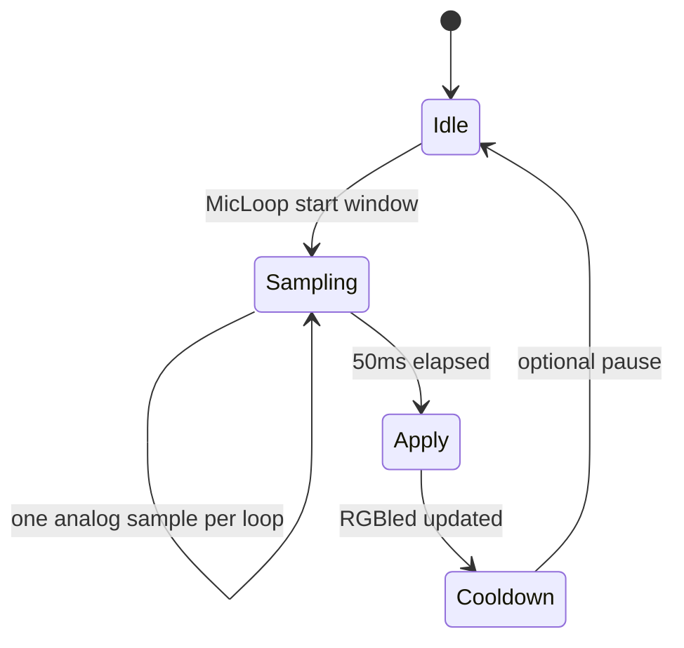

# Plan 4 — Loop responsiviteit & boot-tijd

**Project:** [Arduino-R4_UNO_Wall-Z](c:/workspace/projects/Arduino_Projects/Arduino-R4_UNO_Wall-Z)  
**Afhankelijkheden:** plan 1 (MicStereo PWM gate); plan 3 als `USE_MIC=1`  
**Geschatte scope:** 1–2 sessies

## Doel

Geen blocking waits in `loop()` — consistent met [`deadline.h`](c:/workspace/projects/Arduino_Projects/Arduino-R4_UNO_Wall-Z/src/deadline.h) en millis-refactor. Setup-delays mogen blijven maar kunnen ingekort worden.

## Probleem 1 — MicStereo 50 ms block (hoogste impact)

[`MicStereo.cpp:48–59`](c:/workspace/projects/Arduino_Projects/Arduino-R4_UNO_Wall-Z/src/MicStereo.cpp):

```cpp
while (millis() - startMillis < sampleWindow) {
    sampleL = analog::ext_analog_1;
    sampleR = analog::ext_analog_3;
    // min/max tracking
}
```

**Effect:** hele loop ~50 ms bevroren wanneer `USE_MIC=1` — PS4, display, sonar missen ticks.

### Huidige logica (behouden)

- `sampleWindow = 50` ms
- Track `signalMaxL/R`, `signalMinL/R` over venster
- Na venster: vergelijk `micR255`/`micL255` met baseline → `pwm_board::RGBled`

### Non-blocking ontwerp

```cpp
enum class MicPhase : uint8_t { Idle, Sampling, Cooldown };

static MicPhase phase = MicPhase::Idle;
static Deadline sampleWindow;
static unsigned int signalMaxL, signalMinL, signalMaxR, signalMinR;
static uint32_t windowStartMs;
```

**MicLoop() per aanroep:**

1. **Idle:** start Sampling; reset min/max; `windowStartMs = millis()`
2. **Sampling:** 1–2 analog reads; update min/max; als `elapsed(millis(), windowStartMs, 50)` → bereken peaks, Apply LED, → Cooldown
3. **Cooldown:** optioneel 10 ms pauze tussen vensters (`Deadline`) → Idle

**Alternatief (eenvoudiger):** elke loop 1 sample; na 50 ms wall time resultaat — geen inner while.

### API-wijziging

Header [`MicStereo.h`](c:/workspace/projects/Arduino_Projects/Arduino-R4_UNO_Wall-Z/src/MicStereo.h): geen signature change nodig als `MicLoop()` intern stateful blijft.

### Edge cases

| Case | Gedrag |
|------|--------|
| `USE_MIC=0` | MicLoop niet aangeroepen (plan 1 gate) |
| PWM uit | plan 1 FEATURE_ENABLED skip LED |
| analog niet gelezen | `analog::analogLoop()` moet vóór MicLoop in [`main_ra.cpp`](c:/workspace/projects/Arduino_Projects/Arduino-R4_UNO_Wall-Z/src/main_ra.cpp) — controleren volgorde |

## Probleem 2 — Sonar pulseIn

[`avoid_objects.cpp`](c:/workspace/projects/Arduino_Projects/Arduino-R4_UNO_Wall-Z/src/avoid_objects.cpp) — `pulseIn(Echo_PIN, HIGH, 47058)` kan ~47 ms duren.

**Huidige mitigatie:** [`main_ra.cpp:338–340`](c:/workspace/projects/Arduino_Projects/Arduino-R4_UNO_Wall-Z/src/main_ra.cpp) throttle 60 ms tussen metingen.

**Optionele verbeteringen:**

1. Timeout verlagen naar ~30000 µs (~5 m max) — voldoende voor robot (~2 m)
2. `checkDistance()` alleen aanroepen als niet in avoid/dance active mode (already separate path)
3. Documenteer: distance loop ≠ avoid_objects tick (avoid gebruikt eigen timing)

**Niet doen:** `pulseIn` vervangen door IRQ zonder hardware test — scope creep.

## Probleem 3 — Setup delay-pad (~29× delay)

[`main_ra.cpp:130–281`](c:/workspace/projects/Arduino_Projects/Arduino-R4_UNO_Wall-Z/src/main_ra.cpp) — vooral `delay(500)` tussen module-inits.

### Audit per delay

| Locatie | Reden | Actie |
|---------|-------|-------|
| 114–122 | Serial settle 1 ms | Behouden |
| 130, 155, 172, … | "Padding" tussen modules | Reduceer naar 50 ms of verwijder |
| 144, 220 | Switch debounce 50 ms | Behouden |
| displayAdafruit 250 ms | OLED power-up | Behouden ([`displayAdafruit.cpp:42`](c:/workspace/projects/Arduino_Projects/Arduino-R4_UNO_Wall-Z/src/displayAdafruit.cpp)) |
| gyroscope 10 ms | MPU6050 sample | Behouden in calibratie loop |

**Doel:** SD setup-pad van ~15 s → ~5 s zonder hardware regressie.

### Veilige aanpak

1. Eén module per commit timing meten
2. I2C devices (gyro, compass, BMP280) minstens 100 ms na power-up eerste keer
3. Geen delay tussen zuiver software stappen (logger, pinMode)

## Probleem 4 — ESP32 serial drain (laag)

[`main_ra.cpp:383–385`](c:/workspace/projects/Arduino_Projects/Arduino-R4_UNO_Wall-Z/src/main_ra.cpp) — `while (SERIAL_AT.available())` — kort, acceptabel. Alleen actief als `READ_ESP32=1`.

## Verificatie

1. **Latency test:** PS4 stick bewegen terwijl `USE_MIC=1` — geen merkbare stutter vs MIC uit
2. **Boot tijd:** Serial timestamp setup start → "Setup Complete" — voor/na delay audit
3. **Sonar:** distance waarden nog stabiel op 35 cm drempel (LED rood)
4. `pio run -e src` — geen flash significante stijging

## Niet in scope

- `delay()` in gyro calibratie ([`gyroscope.cpp:66–75`](c:/workspace/projects/Arduino_Projects/Arduino-R4_UNO_Wall-Z/src/gyroscope.cpp)) — boot-only
- FreeRTOS tasks / dual-core
- Mic FFT / frequency analysis

## Bestanden

| Bestand | Wijziging |
|---------|-----------|
| [`src/MicStereo.cpp`](c:/workspace/projects/Arduino_Projects/Arduino-R4_UNO_Wall-Z/src/MicStereo.cpp) | State machine |
| [`src/MicStereo.h`](c:/workspace/projects/Arduino_Projects/Arduino-R4_UNO_Wall-Z/src/MicStereo.h) | Optioneel phase enum doc |
| [`src/main_ra.cpp`](c:/workspace/projects/Arduino_Projects/Arduino-R4_UNO_Wall-Z/src/main_ra.cpp) | Setup delays + loop volgorde check |
| [`src/avoid_objects.cpp`](c:/workspace/projects/Arduino_Projects/Arduino-R4_UNO_Wall-Z/src/avoid_objects.cpp) | pulseIn timeout |



## Acceptatiecriteria

- Geen `while (millis()-...)` in MicLoop
- PS4 + display + distance blijven responsief met MIC aan
- Setup SD-pad ≥ 30% korter (gemeten)
