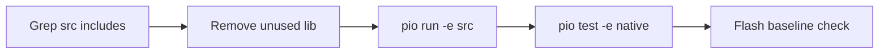

# Plan 5 — Build opschoning & test-suite

**Project:** [Arduino-R4_UNO_Wall-Z](c:/workspace/projects/Arduino_Projects/Arduino-R4_UNO_Wall-Z)  
**Afhankelijkheden:** plan 2 levert `test_sd_config`; kan parallel met plan 3  
**Geschatte scope:** 1 sessie audit + 1 sessie cleanup

## Doel

Kortere builds, minder LDF-ruis, geen terugkeer van zware deps. Native tests als regressie-guard naast bestaande deadline + ps4_parse.

## Huidige build-config

[`platformio.ini`](c:/workspace/projects/Arduino_Projects/Arduino-R4_UNO_Wall-Z/platformio.ini) `[env:src]`:

| Setting | Waarde |
|---------|--------|
| board | uno_r4_wifi (256 KB flash) |
| build_type | release |
| build_src_flags | `-DSERIAL_AT=Serial2`, `-Wall`, `-Wextra` |
| lib_deps | **35 packages** (regels 31–66) |
| lib_ignore | WiFiS3 |
| Flash baseline | 103.596 B (39,5%) na STL-refactor |

[`env:native`](c:/workspace/projects/Arduino_Projects/Arduino-R4_UNO_Wall-Z/platformio.ini) — Unity tests, `-I src`, geen test_filter (deadline + ps4_parse).

## lib_deps audit (voorlopig)

Grep op `#include` in `src/` — **geen directe includes** gevonden voor:

| Library | Vermoeden | Actie |
|---------|-----------|-------|
| olikraus/U8g2 | Alleen USE_U8G2=0 | Verwijderen na build test |
| Adafruit GC9A01A | USE_ROUND=0 | Verwijderen |
| Adafruit EPD | Niet gebruikt | Verwijderen |
| Adafruit ImageReader | Niet gebruikt | Verwijderen |
| DHT sensor library | Niet in src | Verwijderen |
| AsyncTCP | Niet in src | Verwijderen |
| ArduinoJson | Niet in src | Verwijderen |
| PubSubClient | Niet in src | Verwijderen |
| UIPEthernet | Niet in src | Verwijderen |
| ArduinoMenu library | USE_MENU=0, geen include | Verwijderen |
| javadad01/AT32F4 | Onbekend | Verwijderen na verify |
| greiman/SdFs | Duplicaat naast SdFat fork | Eén behouden |
| https AXP202X + AXP202X_Library | Dubbel | Eén behouden |

**Behouden (confirmed used via LDF chain):**

- SPI, Wire, Ticker, RTC, SD
- Adafruit MPU6050, SSD1306, PWM Servo, Unified Sensor, BusIO, GFX, BMP280, HMC5883, SH110X, SPIFlash
- SdFat (SD_card.cpp)
- TimerEvent (timers.cpp als USE_TIMERS)
- OLED SSD1306 SH1106 (display)
- NTPClient, ADS1X15 (analog/I2C pad)
- cygig/TimerEvent

### Audit procedure

```powershell
# Per lib: zoek includes en symbolen in src/
rg -l "U8g2|GC9A01|PubSub|ArduinoJson" src/
pio run -e src  # na elke removal
```

**Regel:** één lib per commit verwijderen → build → flash meten.

## Verwachte winst

| Actie | Flash | Build tijd |
|-------|-------|------------|
| STL al weg | −141 KB (done) | — |
| lib_deps −15 unused | 0–20 KB extra | −30–60 s link |
| LOG_DEBUG off | 1–3 KB | — |

Flash winst is kleiner nu LDF al selectief linkte; **hoofdwinst = build tijd + onderhoud**.

## Native test-suite uitbreiden

### Bestaand (13 tests)

- [`test/test_deadline`](c:/workspace/projects/Arduino_Projects/Arduino-R4_UNO_Wall-Z/test/test_deadline/test_deadline.cpp) — 8 tests
- [`test/test_ps4_parse`](c:/workspace/projects/Arduino_Projects/Arduino-R4_UNO_Wall-Z/test/test_ps4_parse/test_ps4_parse.cpp) — 5 tests

### Nieuw — plan 2

[`test/test_sd_config`](c:/workspace/projects/Arduino_Projects/Arduino-R4_UNO_Wall-Z/test/test_sd_config) — parse `"KEY,value"` regels

### Optioneel — feature gate logic

[`test/test_feature_enabled/test_feature_enabled.cpp`](c:/workspace/projects/Arduino_Projects/Arduino-R4_UNO_Wall-Z/test/test_feature_enabled/test_feature_enabled.cpp):

Mock struct met `use_sd_card` + flag; test macro expansion:

```cpp
// Simuleer FEATURE_ENABLED gedrag in pure C++
bool featureEnabled(bool useFlag, bool useMacro, bool sdPresent) {
    return sdPresent ? useFlag : useMacro;
}
```

Cases: SD present flag off + macro on → false; no SD macro on → true.

### Pre-commit workflow (handmatig)

```bash
pio test -e native && pio run -e src
```

## Flash / map regressie-guard

Na elke grote wijziging:

1. `pio run -e src` → Flash % noteren
2. `.pio/build/src/firmware.map` → `grep locale` / `libstdc++` moet **leeg** zijn
3. Drempel alarm: flash > 70% → STOP, review wat linked

Baseline documenteren in dit plan: **103.596 B = 39,5%**.

## build_flags optioneel

Overweeg (alleen na lib cleanup):

```ini
build_src_flags =
    -DSERIAL_AT=Serial2
    -Wall -Wextra -Werror=implicit-function-declaration
```

`-Werror` volledig kan te strict zijn voor Arduino headers — incrementeel.

## lib_ignore uitbreiden

Als libs transitief terugkomen:

```ini
lib_ignore =
    WiFiS3
    U8g2
    ...
```

## Niet in scope

- Platform wijzigen (blijft renesas-ra)
- `-Os` vs `-O2` tuning (release al OK)
- CI/CD GitHub Action (tenzij user vraagt)

## Bestanden

| Bestand | Actie |
|---------|-------|
| [`platformio.ini`](c:/workspace/projects/Arduino_Projects/Arduino-R4_UNO_Wall-Z/platformio.ini) | lib_deps trim |
| [`test/test_sd_config/`](c:/workspace/projects/Arduino_Projects/Arduino-R4_UNO_Wall-Z/test/test_sd_config/) | Nieuw (plan 2) |
| [`test/test_feature_enabled/`](c:/workspace/projects/Arduino_Projects/Arduino-R4_UNO_Wall-Z/test/test_feature_enabled/) | Optioneel |

## Acceptatiecriteria

- `lib_deps` ≤ 20 entries
- `pio test -e native` groen (≥ 13 tests, doel ≥ 18 met sd_config)
- `pio run -e src` SUCCESS, flash ≤ 45% bij huidige config.h
- Geen libstdc++ locale in map


