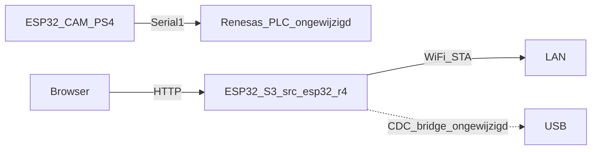

# ESP32-S3 IoT-gateway (`src_esp32_r4` + `platformio.ini`)

**Scope-lock:** wijzigingen in [`src_esp32_r4/`](c:/workspace/projects/Arduino_Projects/Arduino-R4_UNO_Wall-Z/src_esp32_r4) en [`platformio.ini`](c:/workspace/projects/Arduino_Projects/Arduino-R4_UNO_Wall-Z/platformio.ini). **Niet** [`src/`](c:/workspace/projects/Arduino_Projects/Arduino-R4_UNO_Wall-Z/src) (`main_ra.cpp`, logger, PS4, config.h). Native tests mogen in `test/` + `[env:native]`.

PS4-CAM blijft RX/TX op Serial1. MQTT blijft fase 2, nog steeds alleen op de S3.

## Gevolg van de lock

De RA schrijft nu **niets** gestructureerd naar `SERIAL_AT`. Hij leest Serial2 alleen als `READ_ESP32` (default 0) en dumpt dan naar USB. Zonder `src/`-wijzigingen kan de S3 **geen** afstand, flags of motorstatus tonen, en web-`STOP`/`AVOID` doet **niets** op de robot.

Dashboard = **gateway zelf**: WiFi, IP, RSSI, uptime, heap, NTP-tijd, ESP-logs. Robot-PLC blijft ongemoeid.

## Wat `main_ra.cpp` doet (niet aanraken)

PLC-scheduler: PS4 op Serial1, robot-ticks, menu, analog, gyro, sonar, mic, timers. `READ_ESP32` is een USB-dump, geen IoT-protocol. Sensorwaarden zitten in RA-RAM; die blijven daar tot een later plan de UART-bus opent.

## ESP-firmware

Bestanden onder [`src_esp32_r4/`](c:/workspace/projects/Arduino_Projects/Arduino-R4_UNO_Wall-Z/src_esp32_r4):

- [`main_esp.cpp`](c:/workspace/projects/Arduino_Projects/Arduino-R4_UNO_Wall-Z/src_esp32_r4/main_esp.cpp): BLE-demo en emoji-heartbeat weg; `esp_uno_r4_setup()` blijft (CDC/CMSIS-DAP); WiFi STA via [`include/secrets.h`](c:/workspace/projects/Arduino_Projects/Arduino-R4_UNO_Wall-Z/include/secrets.h) (`SECRET_SSID` / `SECRET_PASS`); `WebServer` op poort 80
- [`real_time.cpp`](c:/workspace/projects/Arduino_Projects/Arduino-R4_UNO_Wall-Z/src_esp32_r4/real_time.cpp) / [`real_time.h`](c:/workspace/projects/Arduino_Projects/Arduino-R4_UNO_Wall-Z/src_esp32_r4/real_time.h): NTP uit de uitgecommentarieerde POC, werkend maken
- [`getPost.cpp`](c:/workspace/projects/Arduino_Projects/Arduino-R4_UNO_Wall-Z/src_esp32_r4/getPost.cpp): niet als Node-RED-POST in MVP; web-API vervangt dat. Bestand opschonen of als stub laten zonder RA-protocol
- Nieuwe helpers in **dezelfde folder** (niet in `src/`):
  - status-JSON (IP, RSSI, uptime, heap, SSID, NTP)
  - log-ring voor ESP `Serial`/`LOG`-regels (of bestaande [`src/log_buffer.h`](c:/workspace/projects/Arduino_Projects/Arduino-R4_UNO_Wall-Z/src/log_buffer.h) **alleen includen**, niet wijzigen)

HTTP:

- `GET /` — kleine HTML: status + log, poll elke 500 ms
- `GET /api/status` — JSON van ESP-metrics
- `GET /api/log` — laatste N ESP-logregels
- Geen `POST /api/cmd` naar de robot

Serial-monitor 115200: IP na connect.

## `platformio.ini` (volledig bestand mag)

`[env:esp32_r4]`:

- Weg: `PS4_Controller_Host`, `ArduinoBLE`
- Erbij: WiFi (Arduino-ESP32 core), WebServer; `-I include` voor secrets; eventueel `NTPClient` als `real_time` dat nodig heeft
- Behoud: `ESP_UNO_R4`, `esp_uno_r4_setup()` CDC-bridge
- `monitor_speed = 115200` blijft

`[env:native]`:

- Extra `-I src_esp32_r4` zodat helper-tests de ESP-headers raken zonder `src/` te wijzigen
- Bestaande `-I src` voor RA-tests blijft

`[env:src]`, `[env:esp32_ps4]`, `[env:esp32_cam]`: niet wijzigen.

## Tests

Helpers in `src_esp32_r4` Arduino-vrij waar mogelijk. Nieuw `test/test_esp_gateway/` (raakt `src/` niet):

- status-JSON bevat ip/rssi/uptime-velden
- log-ring wrap (zelfde gedrag als bestaande log_buffer-tests als we die header hergebruiken: dan geen nieuwe ring, alleen ESP-wiring)

Bestaande native suite moet groen blijven. Geen `iot_protocol` STAT/CMD-tests — dat protocol bestaat niet zonder RA.

## Fase 2 (nog steeds zonder `src/`)

MQTT-client op de S3: `wallz/esp/status` (dezelfde ESP-metrics). Robot-topics vragen later alsnog een RA-bridge.

## Hardware-check

Alleen `pio run -e esp32_r4` flashen. Browser naar S3-IP: WiFi/uptime/logs. PS4-rijden ongewijzigd (geen `src`-firmware nodig voor deze stap).
