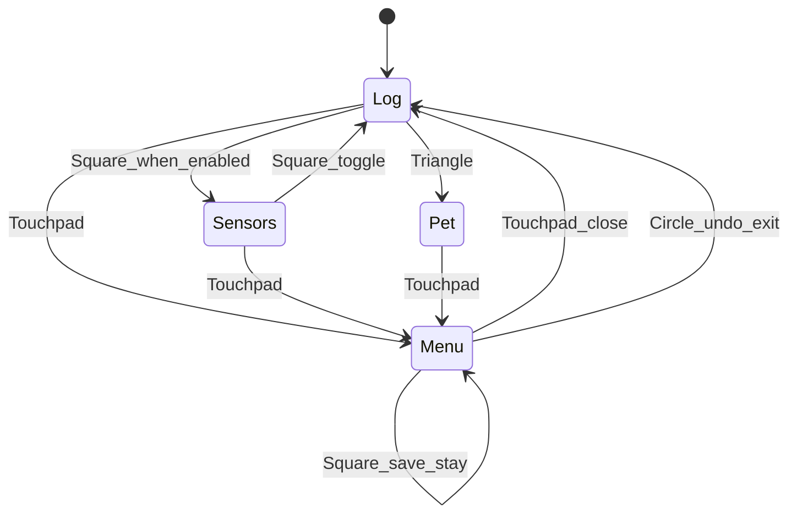

# Schermen, menu-UX, kompas XZ, sensors

## Doel

1. Duidelijke **OLED-schermlogica** (wie mag tekenen).
2. **Menu** open/dicht op **Touchpad**; items tonen **aan/uit** (of value); **X** wijzigen; **Circle** terug/undo; **Square** save.
3. Sensorweergave + impact-log (accel/gyro/baro/mic L-R/licht L-R/distance).
4. Kompas heading op horizontale **X/Z** (Y omhoog).

## OLED mode FSM

[`oled_mode.h`](c:/workspace/projects/Arduino_Projects/Arduino-R4_UNO_Wall-Z/src/oled_mode.h):

| Mode | Wie tekent | Enter |
|------|------------|--------|
| Log | log-ring | default / na menu-sluiten zonder sensors |
| Sensors | sensorpage ~250 ms | Square *buiten* menu *of* menu-flag + later shortcut |
| Menu | `menu::loopMenu` | Touchpad open |
| Pet | animatie | Triangle (bestaand) |

Regels:

- Menu heeft prioriteit: open → `OledMode::Menu`; D-pad/X/Circle/Square gaan naar menu-API.
- Sluiten menu (Touchpad opnieuw, of Circle undo-exit) → terug naar vorige mode (snapshot `OledMode` bij open).
- Native tests voor allow-draw per mode.

## Menu-UX (Touchpad / X / Circle / Square)

Huidig: Cross = toggle+**direct save**; D-pad alleen als `use_pwm_board`; Touchpad = barometer; Circle = petStatus; Square = leeg.

**Nieuw** ([`menu.h`](c:/workspace/projects/Arduino_Projects/Arduino-R4_UNO_Wall-Z/src/menu.h) / [`menu.cpp`](c:/workspace/projects/Arduino_Projects/Arduino-R4_UNO_Wall-Z/src/menu.cpp) / [`PS4.cpp`](c:/workspace/projects/Arduino_Projects/Arduino-R4_UNO_Wall-Z/src/PS4.cpp)):

| Knop | Buiten menu | In menu |
|------|-------------|---------|
| Touchpad | open menu (+ snapshot flags + vorige OledMode) | sluit menu (houdt unsaved? → **verwerp** zoals undo, tenzij net saved) |
| D-pad U/D | (ongewijzigd head/servo of niets) | vorige/volgende item — **niet** achter PWM-gate |
| X (Cross) | — | toggle bool (of cycle value); **niet** auto-save |
| Circle | petStatus (bestaand) | **undo**: restore snapshot → Log/vorige mode |
| Square | toggle Sensors page (als `use_oled_sensors`) | **save**: `configSaveSD()` + commit snapshot = current |

Implementatie undo:

- Bij menu-open: kopieer alle `menuFlags` bools naar `sMenuDraftBackup[]`.
- Circle: restore backup → `setMode(previous)`.
- Square save: schrijf SD, backup = current (saved state).
- UI-regel per item: `name` + `ON`/`OFF` (TomThumb); geen aparte screenshot/QR screens in deze iteratie (`current_screen` blijft 0).

## Menu-flags voor schermen / sensors

Bestaande `use_*` blijven. Extra (of hergebruik duidelijke namen) in `main` + SD/menu-tabel:

- `use_oled_sensors` — Square mag Sensors-page tonen
- desgewenst sub-regels op de Sensors-page zelf via bestaande flags: `use_compass`, `use_gyro`, `use_barometer`, `use_distance`, `use_audio` (mics), `use_light`, `use_analog`

Geen nieuwe ESP-codes; alleen RA + SD keys.

## Kompas XZ

[`compass_heading.h`](c:/workspace/projects/Arduino_Projects/Arduino-R4_UNO_Wall-Z/src/compass_heading.h): `atan2(z, x)` + normalize + cardinal.  
[`compass.cpp`](c:/workspace/projects/Arduino_Projects/Arduino-R4_UNO_Wall-Z/src/compass.cpp): geen −90; null-guard; matrix via cardinal. Tests.

## Sensors page + impact

OLED Sensors (als mode + flags): H°/cardinal, A xyz, G xyz, baro T/P, Mic L/R, Light L/R, Dist cm — bronnen `compass`, `gyroscope`, `barometer`, `analog::ext_*`, `avoid_objects::distanceF`.

Impact ([`gyroscope.cpp`](c:/workspace/projects/Arduino_Projects/Arduino-R4_UNO_Wall-Z/src/gyroscope.cpp)): bij `THRESHOLD` accel+gyro loggen (+ compact overige); debounce ~250 ms.

## Verificatie

- Native: oled_mode, compass_heading, eventueel menu-draft helper-tests
- `pio run -e src` + upload UNO

Kopie: [`.cursor/plans/08-compass-oled-sensors.plan.md`](c:/workspace/projects/Arduino_Projects/Arduino-R4_UNO_Wall-Z/.cursor/plans/08-compass-oled-sensors.plan.md).
