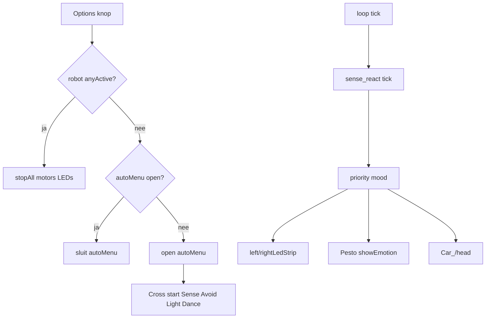

# Sense React + Options autonoom-menu

## Beslissingen
- **Gedrag:** volledig autonoom (motors + hoofd + LED-strips + Pesto-matrix).
- **Options:** opent een **apart** autonoom-menu (niet het Touchpad config-menu). Tijdens een actieve run: **direct stop** van alle autonome modes.
- **L3 / R3:** geen avoid/follow meer. **L3** = laser vol **alleen terwijl/op press** (geen toggle). **R3** = voorlopig ongebruikt.

## Architectuur

Nieuwe helper [`src/robot_modes.h`](c:\workspace\projects\Arduino_Projects\Arduino-R4_UNO_Wall-Z\src\robot_modes.h) (inline, Arduino-vrij waar mogelijk):

- `anyActive()` — `avoid_objects` | `Follow_light` | `dancing` | `sense_react`
- `stopAll()` — stop elk + `Motor::Car_Stop()`

## Options-gedrag in [`PS4.cpp`](c:\workspace\projects\Arduino_Projects\Arduino-R4_UNO_Wall-Z\src\PS4.cpp)

Vervang huidige `OPTION → gyroFunc()`:

1. Als `robot_modes::anyActive()` → `stopAll()`, sluit auto-menu indien open, toon Idle/Wink op matrix.
2. Anders als auto-menu open → sluiten.
3. Anders → open auto-menu.

Touchpad blijft het bestaande config-menu (`menu::open()`).

### Stick-knoppen L3 / R3

| Knop | Actie |
|------|--------|
| **L3** | **Press only (geen toggle):** bij press laser **volop** (`setPWM(LAZER_PIN, 0, 4000)`). Bij release (`2301` indien EVENTS, anders override-timeout / volgende non-held) terug naar distance-map in [`main_ra.cpp`](c:\workspace\projects\Arduino_Projects\Arduino-R4_UNO_Wall-Z\src\main_ra.cpp) (~357–359). |
| **R3** | Geen binding (placeholder / vrij). |

Avoid / Follow Light / Dance / Sense starten **alleen** via het Options auto-menu (niet meer via L3/R3).

Implementatie laser:

- Flag `laserFull` (static/main): true zolang L3 ingedrukt; sonar-loop schrijft dan 4000 i.p.v. `map(distance,…)`.
- **L3 press (2300 / 2310):** `laserFull = true` + PWM 4000 meteen.
- **L3 release (2301):** `laserFull = false` → distance-map hervat. Geen tweede-press-toggle.
- Als ESP alleen base `2300` pollt zonder release: hou full tot er ~200–300 ms geen L3-packet meer komt (zelfde idee als drive watchdog), daarna override uit.
- Max PWM blijft **4000**.

## Autonoom-menu (OLED)

Nieuw klein menu in [`src/auto_menu.h`](c:\workspace\projects\Arduino_Projects\Arduino-R4_UNO_Wall-Z\src\auto_menu.h) / `.cpp` (of uitbreiding van [`menu.cpp`](c:\workspace\projects\Arduino_Projects\Arduino-R4_UNO_Wall-Z\src\menu.cpp) met aparte sessie — **aparte module** om config-menu niet te vervuilen):

Items (D-pad Up/Down, Cross selecteert):

1. **Sense React** → `sense_react::start()` (+ stop andere modes)
2. **Avoid** → `avoid_objects::avoid()`
3. **Follow Light** → `Follow_light::light_track()`
4. **Dance** → `dancing::dance()`
5. **Stop** → `robot_modes::stopAll()`

OLED: hergebruik `OledMode::Menu` of voeg `OledMode::AutoMenu` toe in [`oled_mode.h`](c:\workspace\projects\Arduino_Projects\Arduino-R4_UNO_Wall-Z\src\oled_mode.h) zodat config- en auto-menu niet door elkaar lopen. **Keuze: nieuwe `OledMode::AutoMenu`.**

Navigatie alleen als auto-menu open is (config-menu blijft Touchpad + bestaande knoppen).

## Sense React module

Bestanden: [`src/sense_react.h`](c:\workspace\projects\Arduino_Projects\Arduino-R4_UNO_Wall-Z\src\sense_react.h) / [`src/sense_react.cpp`](c:\workspace\projects\Arduino_Projects\Arduino-R4_UNO_Wall-Z\src\sense_react.cpp) — zelfde patroon als avoid/follow: `start` / `stop` / `tick` / `isActive`.

Tick (~80–100 ms via `elapsed`) met **vaste prioriteit**:

| Prio | Sensor | Emotie / LED | Actie |
|------|--------|--------------|--------|
| 1 | Distance &lt; 35 cm | Alert, rood strips | Stop of kort achteruit |
| 2 | Gyro/acc impact (`THRESHOLD`) | Alert, oranje flash | Kort stop + hoofd-nod |
| 3 | Luide mic L/R | Curious / Look L/R; cyan; links/rechts strip asymmetrie | Draai naar luidste kant + hoofd |
| 4 | Sterk licht L/R (&gt;650) | Happy, geel/groen | Zacht naar licht |
| 5 | Compass dominante sector | Look*, groen tint | Alleen hoofd pan |
| 6 | Baro ΔT of ΔP | Wink / Idle, blauw | Geen motors |
| 7 | Idle | Idle, dim paars `(70,0,70)` | Stop |

Zuivere mapping in [`src/sense_mood.h`](c:\workspace\projects\Arduino_Projects\Arduino-R4_UNO_Wall-Z\src\sense_mood.h) (Arduino-vrij): snapshot → `PestoEmotion` + motor-intent enum — voor native tests.

LED-hulp in [`pwm_board`](c:\workspace\projects\Arduino_Projects\Arduino-R4_UNO_Wall-Z\src\pwm_board.cpp): `applyEmotionLeds(PestoEmotion e)` met look-left/right asymmetrische strips; hergebruikt bestaande `leftLedStrip`/`rightLedStrip` (inclusief 255-invert).

Matrix: bestaande `Pesto::showEmotion(...)`.

## Loop / conflicten

[`main_ra.cpp`](c:\workspace\projects\Arduino_Projects\Arduino-R4_UNO_Wall-Z\src\main_ra.cpp):

- `sense_react::tick()` naast avoid/follow/dance onder `USE_ROBOT`.
- Distance-LED-blok (regels ~360–366) **overslaan** als `robot_modes::anyActive()` — anders overschrijft sonar elke 60 ms de emotie-kleuren.
- [`MicStereo::MicLoop`](c:\workspace\projects\Arduino_Projects\Arduino-R4_UNO_Wall-Z\src\MicStereo.cpp): bij actieve sense_react geen RGB-led schrijven (of MicLoop skippen en peaks via kleine read-API); sense_react leest `analog::ext_analog_1/3` zelf.

Auto-menu start steeds eerst `robot_modes::stopAll()` (of stop siblings) zodat maar één mode tegelijk loopt. L3 laser-toggle raakt autonome modes niet aan.

## Tests

[`test/test_sense_mood/test_sense_mood.cpp`](c:\workspace\projects\Arduino_Projects\Arduino-R4_UNO_Wall-Z\test\test_sense_mood\test_sense_mood.cpp):

- dichtbij → Alert wint van geluid
- gyro impact → Alert
- mic links luider → LookLeft
- licht rechts → Happy / intent right
- idle snapshot → Idle
- `robot_modes` priority helpers indien puur testbaar

Bestaande native suite groen houden; `pio run -e src` builden.

## Opslaan plan

Planbestand: [`Arduino-R4_UNO_Wall-Z/.cursor/plans/09-sense-react-autonome.plan.md`](c:\workspace\projects\Arduino_Projects\Arduino-R4_UNO_Wall-Z\.cursor\plans\09-sense-react-autonome.plan.md).
