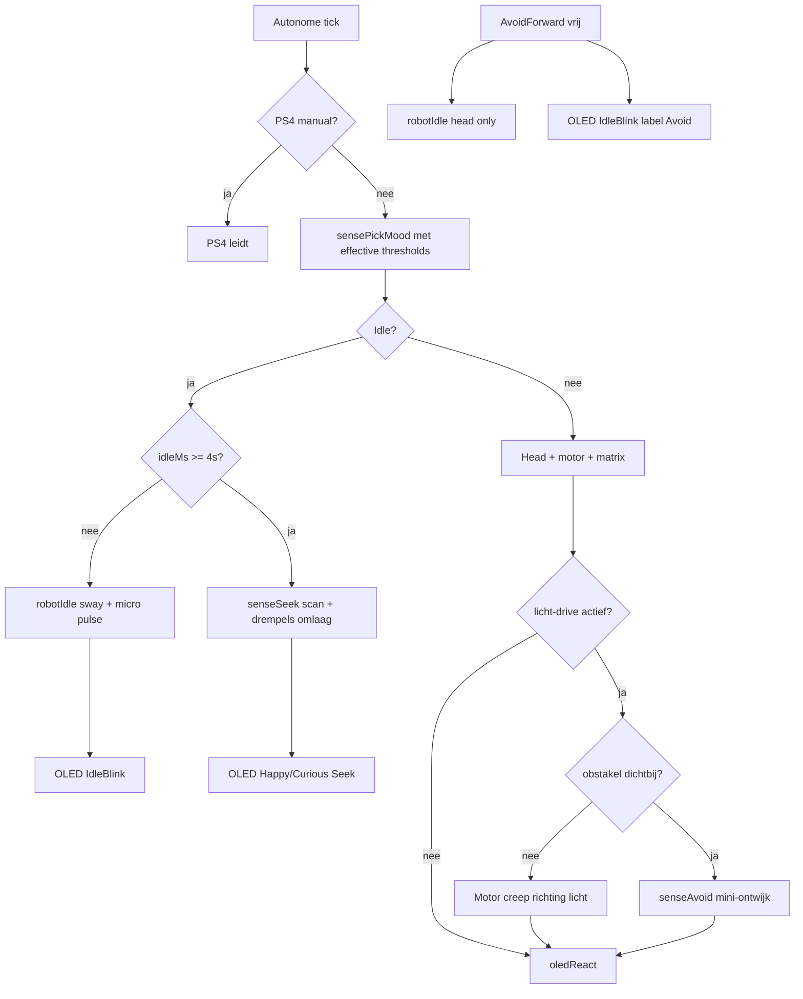

# Sense React: idle life, OLED-animaties, richting-reactie (+ Avoid)

## Doel

1. **Bij geen input**: rustige hoofd-sway + hele lichte L/R track-wiebel (Sense React idle).
2. **Tijdens actieve autonome modes**: OLED toont **full-screen gezichtsanimatie + kort label** (geen tekstlog/menu).
3. **Geluid & licht**: L/R-variatie → kijken + gezicht die kant op; **licht → langzaam richting bron rijden**.
4. **Obstakels tijdens rijden**: ultrasonic **mini-ontwijk** (nod + kijk L/R + draai naar vrijste kant), hergebruikt logica uit [`avoid_objects.cpp`](src/avoid_objects.cpp) — geen volle Avoid-mode, wel veiligheids-overlay boven licht/seek rijden.
5. **Ook in Avoid**: idle head-sway tijdens vrij vooruitrijden; OLED knipper-idle clip.
6. **Na enkele seconden idle**: seek-fase — scan + drempels omlaag; **bij licht-bias tijdens seek → overschakelen naar langzaam licht-volgen** (§2b).

## Referentie-sketches (jouw Downloads)

| Bron | Frames | ms/frame | Gebruik in firmware |
|------|--------|----------|---------------------|
| `oled_display (3).ino` | 12 | 125 | **Idle** — ogen knipperen (rustig “levend”) |
| `oled_display.ino` | 8 | 250 | **Look L/R** — ogen verschuiven (mic/licht richting) |
| `oled_display (1).ino` | 16 | 125 | **Alert** — distance / gyro / schok |
| `oled_display (2).ino` | 20 | 100 | **Happy/Curious** — licht absoluut, baro, algemene reactie |

Patroon uit sketches: `drawBitmap(0, 0, frames[i], 128, 64, SSD1306_WHITE)` — **geen** 4× upscale van 16×8 pesto-bitmaps.

`uno_3phase_tinkercad.ino` / `tremendous_elzing1.ino`: sinus-fase voor **robot_idle** head-sway (zelfde gedachte als `waveform8(SIN)`).



## 1. Gedeelde idle — [`robot_idle.h`](src/robot_idle.h)

Nieuw Arduino-vrij header + `test/test_robot_idle/`:

- Sinus head pan/tilt rond center (~±4°/±3°, ~4 s per cyclus).
- Track micro-puls (~60 ms, PWM ~40) elke ~2.5 s — **alleen Sense React idle**, niet in Avoid.
- `PS4::isManualControlActive()` gate.

**Integratie:**
- [`sense_react.cpp`](src/sense_react.cpp): bij `Idle` + geen manual → eerst passive idle; na seek-timeout → seek-fase (§1b).
- [`avoid_objects.cpp`](src/avoid_objects.cpp): **alleen** `AvoidForward` + pad vrij → **head-sway overlay**; bij nod/turn/obstacle geen idle. **Geen seek-fase** in Avoid (blijft vooruit rijden).

### 1b. Idle → seek — `sense_seek.h`

Na **~4 s** aaneengesloten idle (geen `sensePickMood`-trigger, geen PS4 manual) schakelt Sense React naar **seek-modus**. Timer reset bij elke echte reactie of manual input.

Nieuw Arduino-vrij header + `test/test_sense_seek/`:

```cpp
constexpr uint32_t SENSE_SEEK_AFTER_MS = 4000;
constexpr uint32_t SENSE_SEEK_RAMP_MS  = 8000;  // volle gevoeligheid na ~12s idle totaal

struct SenseThresholds {
  float distanceCm;
  int micLoud;
  int micBias;
  int lightThresh;
  int lightBias;
  float baroDelta;
};

SenseThresholds senseEffectiveThresholds(uint32_t idleStreakMs);
// idleStreakMs=0 → basis drempels uit sense_mood.h
// idleStreakMs>=SEEK_AFTER → lineair omlaag tot ~60% van basis (mic/light/distance)

enum class SenseSeekStep : uint8_t { Center, PanLeft, HoldLeft, PanRight, HoldRight, SoftForward };

struct SenseSeekOutput {
  bool active;
  int headXY; int headZ;
  SenseMotorIntent motorHint;  // Stop of SoftForward tijdens scan
};

SenseSeekOutput senseSeekStep(SenseSeekState&, uint32_t now, uint32_t idleStreakMs);
```

**Gedrag seek-fase:**
- **Hoofd**: langzame pan L (140°) → center (90°) → R (40°) → center, ~1.5 s per positie; lichte tilt-neiging naar kant met **hoogste mic/light delta** (live snapshot, geen trigger nodig).
- **Tracks**: optioneel **hele zachte** `SoftForward` tijdens center-hold (~30% PWM, kort); geen agressieve spins.
- **Drempels**: `sensePickMood(snap, thresholds)` gebruikt `senseEffectiveThresholds(idleStreakMs)` — bij langere idle worden mic/light/distance/ baro drempels lager (max ~40% reductie na volle ramp).
- **OLED**: clip **Happy/Curious** + label `"Seek"` (niet meer IdleBlink).
- **Matrix**: `Curious` vasthouden tijdens seek.

- **Tracks**: tijdens seek **zacht forward**; zodra licht boven drempel op één kant → **licht-volgen** i.p.v. blinde scan (§2b).

**Wijziging `sense_mood.h`:** `sensePickMood(const SenseSnapshot&, const SenseThresholds& t = defaults)` — defaults = huidige constexprs; seek passeert effective thresholds.

## 2. Richting-reactie & licht-volgen — [`sense_mood.h`](src/sense_mood.h)

- `SenseTrigger` enum + `trigger` in `SenseMoodResult`.
- Mic L/R-diff → `LookLeft`/`LookRight` + zacht draaien (ongewijzigd).
- **Licht** (nieuw gedrag):
  - Baseline L/R bij `start()`; `|L-R| >= lightBias` → Look L/R + **`SenseMotorIntent::CreepLeft/Right`**.
  - Beide boven drempel → **`CreepForward`** (langzaam rechtdoor naar licht).
  - Zwak licht alleen → geen rijden, alleen head.
- `senseTriggerLabel()`: `"Light L"`, `"Light R"`, `"Light +"`, `"Avoid"`, …

### 2b. Langzaam licht-volgen — `light_drive.h` + [`motor.cpp`](src/motor.cpp)

Arduino-vrij intent + dunne motor-laag:

```cpp
constexpr uint8_t MOTOR_CREEP_PWM = 110;  // vs 200 forward / 255 turn in motor.cpp

enum class LightDriveIntent : uint8_t { None, CreepForward, CreepLeft, CreepRight };

LightDriveIntent lightDriveIntent(int lightL, int lightR, const SenseThresholds& t);
```

Nieuw in `Motor` (minimale diff):

```cpp
static void Car_creepForward();  // L/R_PWM = MOTOR_CREEP_PWM
static void Car_creepLeft();
static void Car_creepRight();
```

[`sense_react.cpp`](src/sense_react.cpp): bij licht-trigger of seek met licht-bias → `lightDriveIntent` → creep motor + head richting licht. **Geen** full-speed `Car_front()` meer voor licht in Sense React (bestaande [`follow_light.cpp`](src/follow_light.cpp) blijft aparte auto-menu mode op volle snelheid).

### 2c. Mini obstacle-ontwijk — `sense_avoid.h`

Non-blocking sub-state machine (extract van [`avoid_objects.cpp`](src/avoid_objects.cpp) AvoidForward→Turn), **alleen actief** wanneer Sense React **creept** (licht/seek forward):

```cpp
enum class SenseAvoidPhase : uint8_t { Clear, Blocked, Nod, LookL, LookR, Turn, Resume };

struct SenseAvoidOutput {
  SenseAvoidPhase phase;
  bool overrideMotor;   // true → sense_react gebruikt avoid i.p.v. mood motor
  SenseMotorIntent motor;
  PestoEmotion headEmotion;  // Alert tijdens ontwijken
};

SenseAvoidOutput senseAvoidStep(SenseAvoidState&, float distF, float distL, float distR, uint32_t now);
```

| Afstand voor | Actie |
|--------------|-------|
| `distF >= 35 cm` | Clear — licht-creep gaat door |
| `distF < 35 cm` | Stop creep → mini nod/look L/R (head) → draai naar kant met **meer ruimte** (zelfde `< 50 cm` vergelijking als avoid) → korte turn → Resume creep |
| `distF < 25 cm` | Direct stop (match avoid_objects drempel) |

- Distance via bestaande `avoid_objects::checkDistance()` / cache in `sense_react::tick()`.
- **Prioriteit**: obstacle-overlay **wint** boven licht-creep; na Resume hervat licht-volgen.
- **OLED**: Alert clip + `"Near"` tijdens ontwijk; daarna terug naar Light-label.
- **Niet** de volledige `avoid_objects`-mode starten (mutual exclusion blijft); alleen gedeelde steer-logica.

Tests: `test/test_sense_avoid/` (phase transitions, pick clearer side), `test/test_light_drive/` (intent from L/R values).

## 3. OLED full-screen animaties — nieuwe asset-laag

### Import — `src/oled_faces/`

Script/handmatig: PROGMEM `frameN[1024]` uit Downloads → headers, bv.:

- `oled_face_idle_blink.h` (12 frames)
- `oled_face_look_lr.h` (8 frames)
- `oled_face_alert.h` (16 frames)
- `oled_face_happy.h` (20 frames)

### Player — `oled_face_clip.h` (Arduino-vrij waar mogelijk)

```cpp
struct OledFaceClip {
  const uint8_t* const* frames;
  uint8_t frameCount;
  uint16_t frameIntervalMs;
};

enum class OledFaceClipId : uint8_t {
  IdleBlink, LookLR, Alert, Happy
};

OledFaceClip oledFaceClip(OledFaceClipId id);
uint8_t oledFaceAdvanceFrame(OledFaceClipId clip, uint8_t frameIdx, uint32_t now, uint32_t lastMs);
const uint8_t* oledFaceFrame(OledFaceClipId clip, uint8_t frameIdx);
```

Mapping mood/trigger → clip:

| Trigger / mood | Clip | Label |
|----------------|------|-------|
| Idle (passive) | IdleBlink | Idle |
| Idle seek (≥4s) | Happy | Seek |
| Mic L/R | LookLR | Mic L / Mic R |
| Light L/R / Light + | LookLR / Happy | Light L / R / + |
| Obstacle tijdens creep | Alert (avoid) | Near |
| Gyro | Alert | Shock |
| Baro / Happy | Happy | Baro / — |
| Avoid active forward | IdleBlink | Avoid |

LookLR: frame-index offset op basis van richting (eerste helft = links, tweede = rechts) — exacte frame-split na visuele check bij import.

### Display — [`displayAdafruit.cpp`](src/displayAdafruit.cpp)

- `OledMode::SenseReact` (+ `OledMode::Avoid` voor avoid-OLED).
- `drawSenseReactPage(OledFaceClipId clip, uint8_t frameIdx, const char* label)`:
  - Full `drawBitmap(0, 0, …, 128, 64)`.
  - TomThumb label onderaan (8 px band) of overlay rechtsonder.
  - Clip/frame advance in tick (~100–250 ms per clip).
- Lifecycle: `sense_react::start/stop`, `avoid_objects::start/stop`; menu sluiten → terug naar actieve mode ([`menu.cpp`](src/menu.cpp) snapshot).

### Auto-menu — [`auto_menu.cpp`](src/auto_menu.cpp)

Tijdens **selectie**: kleine preview-frame (1e frame van clip) + korte naam per mode — geen volledige animatie in menu (flash/tijd).

### Dot matrix

[`pesto_matrix.cpp`](src/pesto_matrix.cpp): bestaande 16×8 `PestoEmotion` bitmaps blijven voor LED-matrix; **OLED gebruikt aparte 128×64 clips** (niet upscalen).

Optioneel later: gedeelde `pesto_face_bitmap.h` alleen voor matrix + menu-thumbnail fallback.

## 4. PS4 manual override — [`PS4.cpp`](src/PS4.cpp)

`isManualControlActive()`: sticks, L2/R2, recent head RX/RY buiten deadzone.

## 5. Avoid uitbreiding — [`avoid_objects.cpp`](src/avoid_objects.cpp)

| Stap | Head idle | OLED |
|------|-----------|------|
| AvoidForward, pad vrij | ja (sway) | IdleBlink + "Avoid" |
| Nod / look / turn | nee | Alert clip of freeze laatste frame |
| PS4 manual | nee | — |

## 6. Tests & build

| Test | Inhoud |
|------|--------|
| `test_robot_idle` | sinus targets, pulse timing |
| `test_sense_seek` | threshold ramp, seek pan sequence, idleStreak reset |
| `test_sense_mood` | light L/R, creep intents, trigger labels |
| `test_light_drive` | lightDriveIntent per L/R/drempel |
| `test_sense_avoid` | mini-ontwijk fases, clearer-side pick |
| `test_oled_face_clip` | clip metadata, frame advance wrap |
| `test_oled_mode` | SenseReact + Avoid draw gates |

`pio test -e native` + `pio run -e src`.

**Flash:** ~50–60 KB PROGMEM voor alle clips — OK op UNO R4; documenteer in comment bij headers.

## Bestanden

| Actie | Bestand |
|-------|---------|
| Nieuw | `robot_idle.h`, `sense_seek.h`, `light_drive.h`, `sense_avoid.h`, `oled_face_clip.h`, `src/oled_faces/*.h`, `sense_trigger.h` |
| Wijzig | `sense_mood.h`, `sense_react.cpp`, `motor.cpp/.h`, `avoid_objects.cpp`, `displayAdafruit.cpp/.h`, `oled_mode.h`, `auto_menu.cpp`, `PS4.cpp/.h`, `menu.cpp` |
| Tests | `test/test_robot_idle/`, `test/test_sense_seek/`, `test/test_light_drive/`, `test/test_sense_avoid/`, `test/test_oled_face_clip/`, uitbreiding sense_mood + oled_mode |

## Gedragssamenvatting

| Situatie | Hoofd | Tracks | OLED |
|----------|-------|--------|------|
| Sense idle (0–4s) | sway | micro-wiebel | IdleBlink "Idle" |
| Sense seek (≥4s) | L/R scan → licht? | creep naar licht | Happy "Seek" |
| Licht gedetecteerd | Look richting licht | **creep** forward/L/R | LookLR / Happy |
| Obstakel tijdens creep | nod + look | mini-ontwijk | Alert "Near" |
| Mic L/R | Look | zacht L/R (geen creep) | LookLR + label |
| Avoid forward vrij | sway | Car_front | IdleBlink "Avoid" |
| PS4 actief | PS4 | PS4 | actieve mode of Menu |
