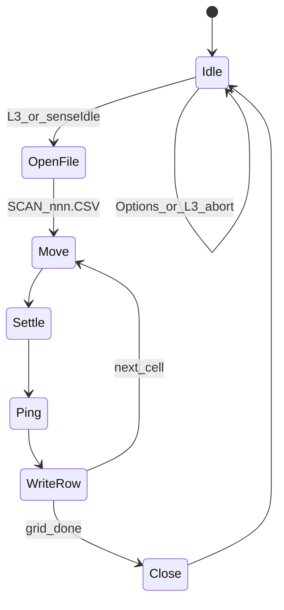
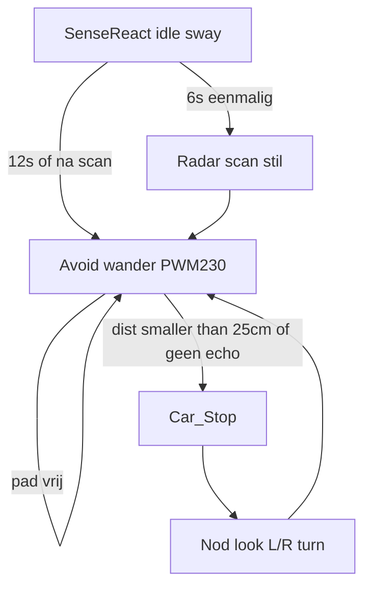

# Radar 3D-scan (HC-SR04 + hoofd)

Ja. De ultrasonic + pan/tilt-hoofd is een grove lidar: raster vegen, afstand meten, bolcoördinaten naar XYZ, streamen naar SD. De UNO tekent geen 3D; de wolk bekijk je op de PC.

## Servo ↔ fysieke hoek

Huidige conventie in [ps4_head.h](c:/workspace/projects/Arduino_Projects/Arduino-R4_UNO_Wall-Z/src/ps4_head.h) / [robot_idle.h](c:/workspace/projects/Arduino_Projects/Arduino-R4_UNO_Wall-Z/src/robot_idle.h):

- Pan XY: lager = rechts, 90 = vooruit, hoger = links. Bereik **0–180°** (180° horizontaal).
- Tilt Z: lager = omhoog, hoger = omlaag. Idle Z **135** = **45° omlaag**; Z **90** = horizon; Z **0** = **90° omhoog**.

Formule (native-testbaar in `radar_scan.h`):

- `panDeg = 90 - servoXY`  → rechts +90, vooruit 0, links −90
- `tiltDeg = 90 - servoZ` → omlaag −45, horizon 0, omhoog +90
- `x = d * cos(tilt) * sin(pan)` (rechts)
- `y = d * cos(tilt) * cos(pan)` (vooruit)
- `z = d * sin(tilt)` (omhoog)

Ongeldige echo (`dist < 0` of timeout) wordt overgeslagen, niet als 0 cm opgeslagen.

## Scan-raster (eerste versie, ~10–15 s)

- Pan-stap **10°** → 19 posities (servo XY 0, 10, … 180)
- Tilt-stap **15°** → 10 rijen (servo Z 135 → 0)
- **190 punten** × (settle ~40 ms + ping tot ~20 ms) ≈ 12 s, robot stil

Zigzag: even rijen L→R, oneven R→L (minder servo-travel).

## Afstand tijdens scan

[avoid_objects::checkDistance()](c:/workspace/projects/Arduino_Projects/Arduino-R4_UNO_Wall-Z/src/avoid_objects.cpp) gebruikt `pulseIn(..., 3000)` ≈ **50 cm max** — te kort voor een kamer.

Scan gebruikt een aparte ping: timeout **20000 µs** ≈ **3,4 m** (HC-SR04-plafond). Alleen in radar-tick, niet in de 60 ms obstacle-loop, zodat Avoid/Sense React snel blijven.

## Non-blocking state machine

Niet de hele 180° in één `loop()`. Per tick één cel:



`radar_scan::tick()` in [main_ra.cpp](c:/workspace/projects/Arduino_Projects/Arduino-R4_UNO_Wall-Z/src/main_ra.cpp) naast de andere modes. Motors stoppen. Options / tweede L3 / `robot_modes::stopAll()` breekt af en sluit het bestand.

## SD-bestand

Pad: `SCAN001.CSV`, `SCAN002.CSV`, … (volgende vrije 8.3-naam). Header + één regel per geldig punt, **geen `String`** (heap; zie plan 02):

```
# Wall-Z radar
# pan_deg,tilt_deg,dist_cm,x_cm,y_cm,z_cm
-90.0,-45.0,82.4,...
```

Streamen: open bij start, `print` per punt, close bij einde/abort. RAM houdt geen wolk bij.

## Triggers

- **L3** (nu laser): toggle radar. [R3 bestaat niet] op deze controller.
- **Laser vol**: verhuizen naar **Share** (`2800`); kompas-matrix blijft bereikbaar via Square sensors-pagina.
- **Sense React idle**: na ~6 s aaneengesloten idle **één** scan (robot stil). Cooldown ~60 s. Daarna (of als er al gescand is) over naar **object-avoid** — zie hieronder.

[PS4.cpp](c:/workspace/projects/Arduino_Projects/Arduino-R4_UNO_Wall-Z/src/PS4.cpp): L3-cases (`2300`/`2310`/`2301`) van `laser_beam` naar `radar_scan` start/stop; Share krijgt `laser_beam::onPress/onRelease`.

[robot_modes.cpp](c:/workspace/projects/Arduino_Projects/Arduino-R4_UNO_Wall-Z/src/robot_modes.cpp): `radar_scan` in `anyActive()` / `stopAll()`.

## Idle → object-avoid (meer power, hard stop)

Na idle (en eventueel de radar-scan) mag de robot **rondrijden**, niet blijven wiebelen. Nu kiest [sense_playful.h](c:/workspace/projects/Arduino_Projects/Arduino-R4_UNO_Wall-Z/src/sense_playful.h) na 12 s willekeurig Dance / Avoid / FollowLight. **Vanuit idle altijd Avoid** (geen dance/light in deze burst).

### Willekeurig rijden — iets meer vermogen

[avoid_objects.cpp](c:/workspace/projects/Arduino_Projects/Arduino-R4_UNO_Wall-Z/src/avoid_objects.cpp) `AvoidForward` gebruikt nu `Motor::Car_front()` = PWM **200**. Voor deze hosted/idle-Avoid-burst:

- Vooruit/rondrijden: PWM **~230** (tussen creep 110 en bocht 255) — voelbaar sneller, niet vol gas.
- Bochten bij ontwijken blijven 255.
- Af en toe een korte willekeurige L/R-puls terwijl het pad vrij is (niet alleen rechtdoor tot een muur).

Constante bv. `MOTOR_AVOID_PWM = 230` in [light_drive.h](c:/workspace/projects/Arduino_Projects/Arduino-R4_UNO_Wall-Z/src/light_drive.h) of `motor.h`; `Motor::Car_avoidForward()` zodat de gewone `Car_front()` (200) voor andere modes hetzelfde blijft.

### Altijd stoppen als het te dichtbij is

Hoger PWM mag de obstakel-check **nooit** overslaan. In AvoidForward, vóór elke drive-write:

- `distanceF < 25 cm` (bestaande drempel) → `Car_Stop()` meteen, daarna nod/kijk L/R/draai.
- Geen echo (`distanceF < 0`) → ook stoppen (liever stilstaan dan blind vooruit op 230).
- Zelfde hard-stop in Sense React als `sensePickMood` distance-alert (< 35 cm) wint: motor `Back`/`Stop`, geen avoid-PWM.

Playful-burst 6 s mag langer (bv. 12–15 s) zodat het rondrijden zichtbaar is; Options / L3 / handmatige stick stopt alles.



Native tests: playful pick vanuit idle is altijd Avoid; distance onder drempel → Stop wint van drive-intent.

## Sensors OLED — distance 5 m + mic/licht UX

Ja: de **onderste rij** is nu mic L/R + licht L/R, platgedrukt als `M123/456 Lt789/012` met alleen het speaker-icoon. Distance deelt de rij erboven met baro (`21.5C 1013h 15cm`) en de ping in [avoid_objects.cpp](c:/workspace/projects/Arduino_Projects/Arduino-R4_UNO_Wall-Z/src/avoid_objects.cpp) is `pulseIn(..., 3000)` ≈ **50 cm**, dus 5 m is nu onzichtbaar.

### Distance tot 5 m

- Op de sensors-pagina (refresh ~250 ms) een **eigen ping** met timeout **~29 ms** (500 cm × 58 µs) — niet de 60 ms obstacle-loop (die blijft kort voor Avoid).
- Weergave in **meters**, 1 decimaal, cap 5.0 m: `2.4 m` / bij geen echo `-- m`.
- Horizontale balk 0–5 m naast de tekst (native helper: cm → bar-pixels).
- Baro blijft op dezelfde 16 px-rij, compacter links (`21C`); distance + balk rechts. Icoon: `humidity2_icon16x16` voor distance-kant, of temperature-icoon houden als baro aanwezig is.

### Mic + licht (onderste 16 px)

Twee stroken van **8 px** i.p.v. één cryptische regel:

- Boven: `speak_icon16x16` (of 8 px hoog gecropped) + label **mic** + L/R-balken
- Onder: `sun_icon16x16` + label **lt** + L/R-balken

ADS1015-ruwe waarden (typisch 0–2048) mappen naar balkbreedte. L en R naast elkaar zodat je meteen ziet welke kant luider/lichter is. Geen `M`/`Lt`-prefix meer.

Arduino-vrije helpers in [sensor_format.h](c:/workspace/projects/Arduino_Projects/Arduino-R4_UNO_Wall-Z/src/sensor_format.h): `formatDistMeters`, `sensorBarPx(value, maxVal, maxPx)`. Tekenen van de rechthoeken blijft in [displayAdafruit.cpp](c:/workspace/projects/Arduino_Projects/Arduino-R4_UNO_Wall-Z/src/displayAdafruit.cpp) `drawSensorsPage`. Tests voor meters-string (`"-- m"`, `"5.0 m"` cap) en bar-pixels.

## Python 3D-viewer

[tools/view_radar.py](c:/workspace/projects/Arduino_Projects/Arduino-R4_UNO_Wall-Z/tools/view_radar.py): leest CSV, 3D-scatter (matplotlib), assen robot-frame (Y vooruit, X rechts, Z omhoog). Gebruik: SD in de PC, `python tools/view_radar.py SCAN001.CSV`.

OLED: alleen een logregel `Scan 42/190` — geen 3D op 128×64.

## Tests (native)

`test/test_radar_scan/`:

- servoXY/Z ↔ pan/tilt (0/90/180 en 135/90/0)
- afstand + hoeken → XYZ (vooruit, rechts, omhoog)
- grid-index → volgende cel + zigzag
- ongeldige afstand wordt overgeslagen

Daarna `pio test -e native`.
